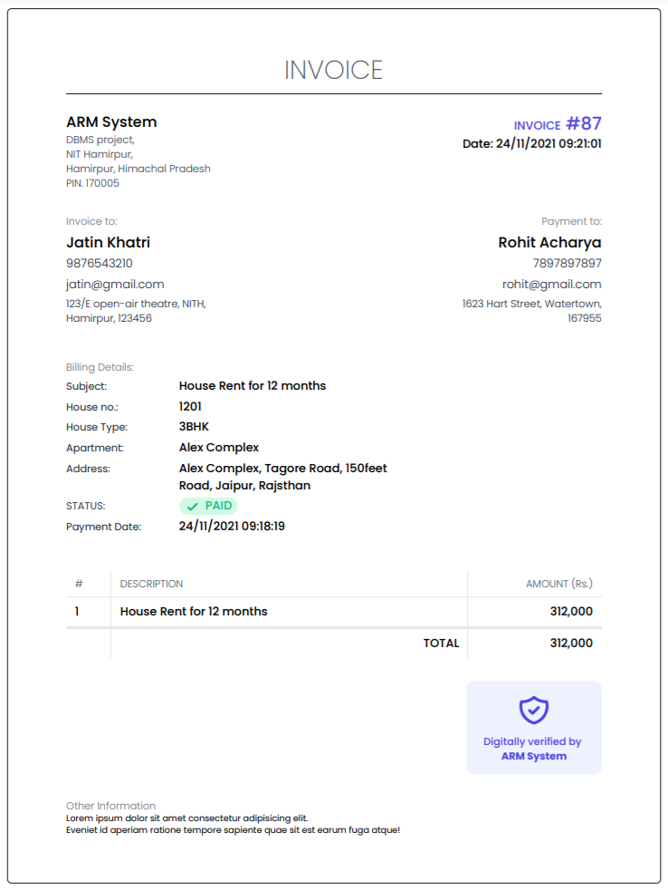

#### NATIONAL INSTITUTE OF TECHNOLOGY, HAMIRPUR

# DBMS PROJECT SUBMISSION

- Amish Ranpariya ( 195554 )
- Rohit Acharya ( 195555 )
- Mayur Kumar ( 195556 )
- Mohd Uvesh ( 195573 )
- Jatin Khatri ( 193092 )

Class: D (CSE-DUAL)

Subject: CS 315 (DBMS LAB)

Date: 20/11/21

## Project Overview

### Topic: Apartment Renting Management System

### Goals and Objectives:

1. To make renting management easier.
2. To create a reliable Web Application that connect user with database using delightful User Interface.
3. To make payment and invoice generation easy and reliable.

### Entities Overview:

- ADMIN: Is our application user, uses our application only after verifying his/her credentials (ID, password).

- OWNER: Is an owner of Whole Apartment/Apartments. And get money from tenants for Rent and Deposits.

- APARTMENT: Is a flat/building/maisonette/any entity containing multiple houses in it. Apartment is owned by Owner. e.g., XYZ society, ABC bungalows, KBH hostel.

- HOUSE: Is a liveable and rentable entity created by owner in his apartment. Tenants occupy these houses for their use and pay Rent and Deposit to Owner of house(apartment). E.g., E-510 Room in KBH apartment, Block no. 12 in XYZ society.

- TENANT: is a person who live in house and pay monthly rent to Owner. Tenant may have multiple houses.

### Entities Relationships:

1. Owner owns apartments. Apartment have only one owner.
2. Owner get paid by Tenants for the house which he/she owns.
3. Tenant can occupy multiple houses. But house can have only one tenant or may be vacant.
4. Apartment can have multiple houses in it. House can be in any one of the apartments.

#### Software Requirement Specification:

1. Admin can login/signup with credentials.
2. Admin can view all registered owners, tenants, apartments, houses.
3. Admin can see full details about owner. E.g., his personal detail, his apartments, total amount he/she gained from renting on our system.
4. Admin can see full details about tenants. E.g., his personal detail, occupied houses, total amount he/she paid for renting his houses.
5. Admin can see full details about apartments. E.g., apartment detail, houses it include, its owner’s details, list of tenants who lives in that apartment.
6. Admin can see full details about houses. E.g., house detail, its occupant detail, owner’s detail and apartment details in which it resides.
7. Admin can view full payment history of rent and deposits.
8. Admin can view all vacant house list.
9. Admin can view all occupied houses and its tenants list and date of assignment of house.
10. Admin can do some action like add owner in database, add tenant, add apartment, add house, vacate the house, place a tenant in house, generate payment receipt, generate monthly and yearly total calculation receipts.

## Project Demo

#### Sign Up page For New User/Admin

.png>)

#### Login Page For Existing User/Admin

.png>)

#### Homepage of Apartment Renting Management System (ARM System)

.png>)
Which Contains Information (Overview) of Database like No. of Registered Owners, No. of Registered Tenants, No. of Apartments, No. of Houses, No. of Payments.

#### Owners List

.png>)

#### Add Owner Form

.png>)

#### Owner’s Detailed Information with Payment Overview, Apartments Info and Payment Info.

.png>)
.png>)

#### Edit Owner Form.

.png>)

#### Tenants List

.png>)

<!-- #### Add Tenant Form. -->

<!-- .png>) -->

#### Tenant’s Detailed Info with Payment Overview, Houses Occupation, Payment Info.

.png>)
.png>)

<!-- #### Edit Tenant Info Form. -->

<!-- .png>) -->

#### Apartments List

.png>)

<!-- #### Add Apartment Form -->

<!-- .png>) -->

#### Apartment’s Detailed Info and it’s Houses Info

.png>)
.png>)

<!-- #### Edit Apartment Details Form -->

<!-- .png>) -->

#### All Houses List

.png>)

#### Vacant Houses List

.png>)

<!-- #### Occupied Houses List -->

<!-- .png>) -->

<!-- #### Add House Form -->

<!-- .png>) -->

#### Detailed House Information (occupied)

.png>)

#### Detailed House Information (Vacant)

.png>)

#### House Assignment Information with its payment history.

.png>)
.png>)

#### Assign House Form.

.png>)

#### Payments History

.png>)

#### Payment Invoice to print

.png>)

#### Demo Invoice

#### House Rent Payment Form

.png>)
